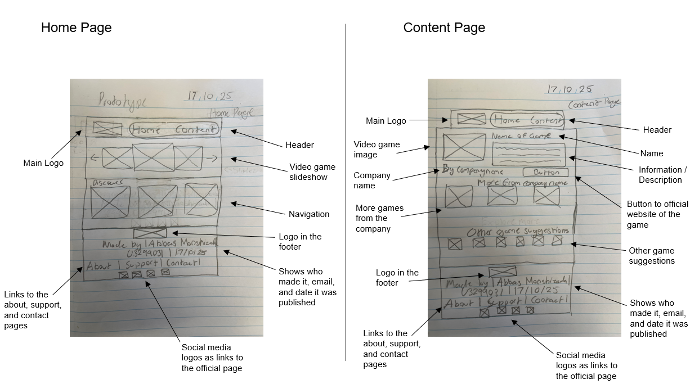
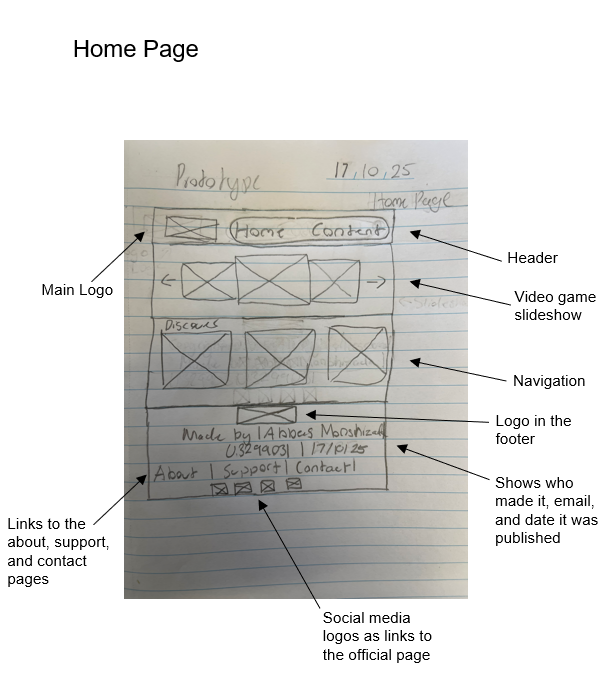
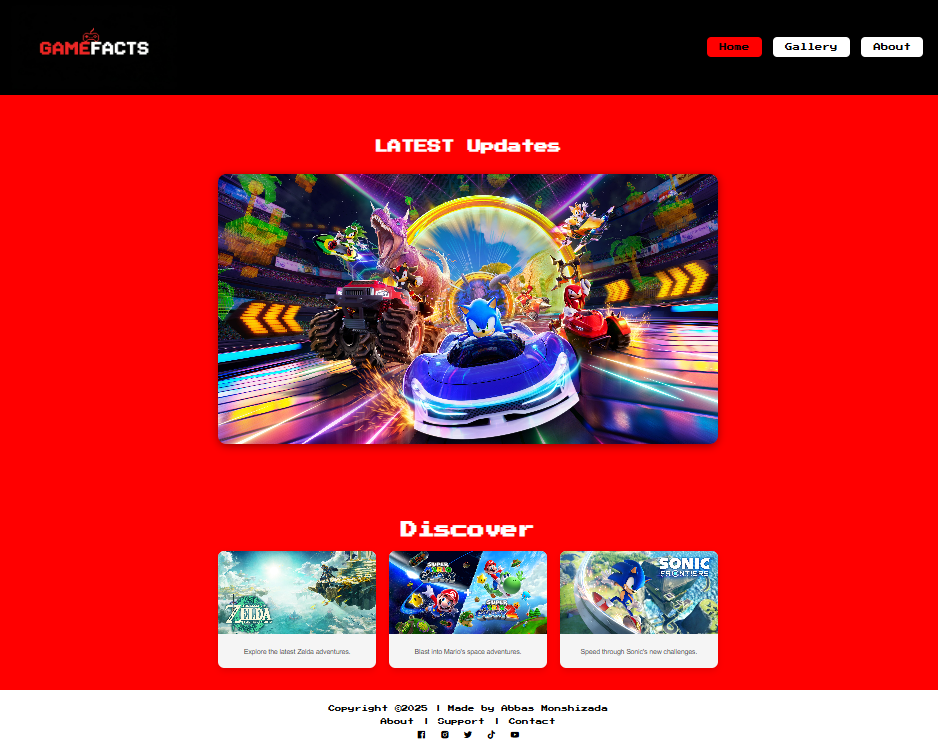
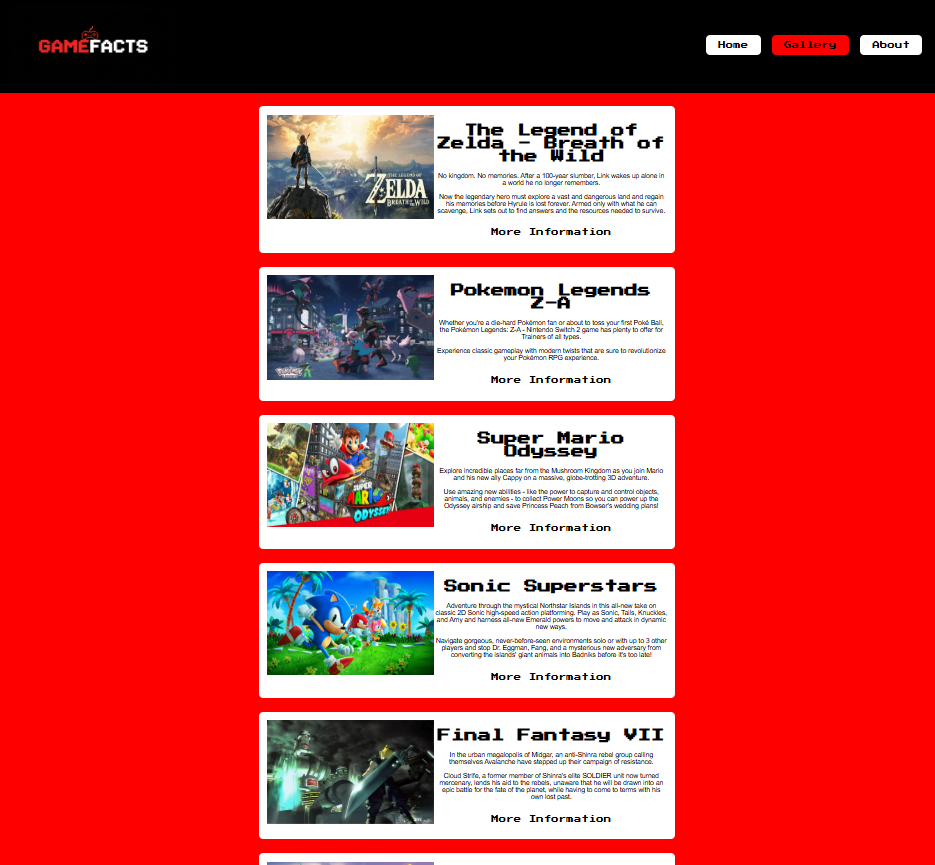

# Project Reflection

Throughout this project, my main goal was to design a website that was simple, organised, and easy for users to navigate. My original low-fidelity sketches focused on having a clear header, a slideshow, obvious navigation, content / gallery, and a clean footer. These ideas stayed important throughout the development process, but I needed to adjust many parts once I turned the sketches into an actual website. 

## Reflection on Development Process

One of the first decisions I made was keeping the layout minimal, because my sketches showed that I wanted the user to immediately recognise the sections like ‘Home’, and ‘Content’, but due to recent feedback, instead of calling it ‘Content’, ‘Gallery’ was the right name as my content page is a gallery page. When I started building, I realised that some elements, especially the slideshow and arrows, and the ‘Discover’ section, were harder to align then I expected. To fix this, I looked at Youtube tutorials or W3Schools to get consistent spacing. This taught me that needing help can make things look easier, but in real development you often need to adapt your design so the website stays functional.

## What Went Well

- In my footer, I included social media icons, and the navigation links to their about, support, and contact. This translated nicely into the final build, and it made the bottom of the site look professional 
- Another element that worked effectively was the main logo replacement. Keeping it in the top left corner of my website helped with branding and made the site feel consistent across pages
- I used JavaScript to make the slideshow autoplay, as it makes the website more engaging
- All the buttons I have added in my website have a hyperlink that when the user clicks on something, it takes them to the related page.

## What Didn’t Work Well

- The elements that I drew for the ‘Content’ page, I didn’t add most of it as it would be and looked overcrowded, so instead I only added the game image, the name, the information, and the button name and repeated it several times. For additional coding, I added a ‘More Games’ section for the users who don’t have interest in games above.
- Most of the time, the arrows are for the user to click on the games that are shown in the slideshow, there were times where I couldn’t align it properly to the center, and I couldn’t place them near the slideshow. 
- The time when I added my custom logo, I wanted to add a link that takes the user back to the home page. I tried several times, but couldn’t get the right result.

## How to carry this into Future Projects
This project taught me skills I can use in future work. I learned that sketches are helpful, but designs usually need changes once you start building, so I'll create quick digital wireframes next time to test ideas earlier. I also realised the value of keeping layouts simple and making small adjustments as I go instead of trying to fix everything at the end. Working with flexbox and grid improved my confidence with layout tools, which will help me build cleaner and more responsive pages in the future. Overall, this project showed me how to plan better, stay flexible, and focus on usability, things I will continue using in my next projects.

## Overall Summary

Overall, my final website is similar to my sketches in structure, but the proportions, spacing, and interactions are cleaner and more polished. The development process helped me understand how design decisions affect usability and how important it is to adjust your ideas once you see them in a real website environment.

---

## Original Low-Fidelity Prototypes

---

## Comparison: Sketches vs. Final Site

 

---

(content_prototype.png)

1. The final website especially the home page, has the same structure (header, slideshow, discover, and footer)
2. Spacing, alignment, and number of content boxes changed to improve clarity
3. Navigation and footer match the sketches but look cleaner in the final version without adding the logo
4. Some sections in the ‘Content’ page were simplified to avoid overcrowding

---

## Annotated List of Helpful Resources

### **W3Schools – HTML & CSS Documentation**
Helped me understand layout basics such as slideshows, hover effects, and general HTML/CSS structure.  
https://www.w3schools.com/html/default.asp

### **Google FX**
Used for creating custom logo designs.  
https://labs.google/fx/

### **Google Fonts & Boxicons**
Used for typography and clean icon design for social media links.  
- https://fonts.google.com/  
- https://boxicons.com/
